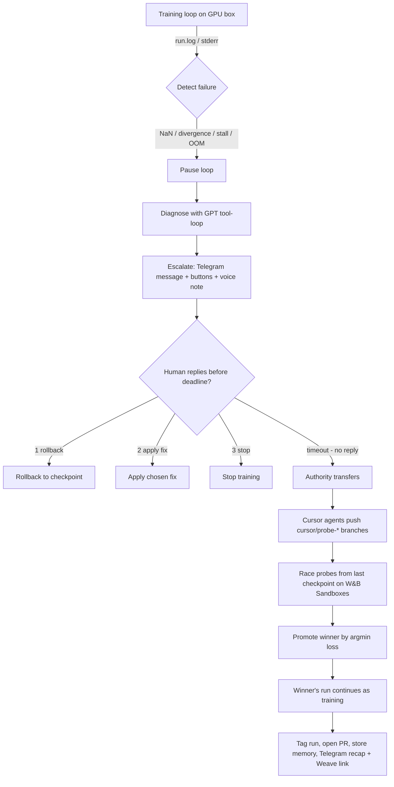

## The incident flow

A single failure produces a single incident, and a single incident is a single Weave
trace tree. Here is the full path from detection to recovery:

<Steps>
  <Step title="Detect">
    The in-process metric hook (or stderr tail in CLI mode) spots a NaN loss, divergence,
    stall, OOM, or exception the moment it happens.
  </Step>
  <Step title="Pause">
    The training loop is paused so nothing else burns GPU time on a doomed run.
  </Step>
  <Step title="Diagnose">
    GPT runs a tool-loop over the run's history, logs, and config (plus past incidents
    recalled from memory) and produces a plain-English diagnosis and up to N fix
    hypotheses.
  </Step>
  <Step title="Escalate">
    You get a Telegram message with inline buttons (**⏪ Roll back**, **🔧 Apply fix**,
    **🛑 Stop**) plus an AI voice note that plays inline in the chat, and a deadline is
    armed (an in-process timer by default, or a Redis ZSET when `REDIS_URL` is set). Tap a
    button or type **1** (rollback), **2** (apply fix), or **3** (stop).
  </Step>
  <Step title="Authority transfer">
    If the deadline expires with no reply, authority transfers to keepalive. It stops
    waiting and acts.
  </Step>
  <Step title="Cursor probe branches">
    keepalive asks Cursor cloud agents to each write a different fix, branching from the
    failing run's exact commit SHA. They push `cursor/probe-*` branches to GitHub.
  </Step>
  <Step title="Sandbox probe race">
    Each branch runs as a short, checkpoint-resumed training run (a "probe") — separate
    W&B runs grouped under the parent — on W&B Sandboxes.
  </Step>
  <Step title="Promote by argmin loss">
    The probe with the lowest finite final loss wins (argmin, not vibes). The losers are
    killed; the winner's run continues as the training.
  </Step>
  <Step title="Recap">
    The parent run is tagged, a PR is opened, the incident is stored in memory, and you
    get a Telegram recap with a link to the full Weave trace.
  </Step>
</Steps>

## The architecture: two machines + one relay

Keep this straight — it's the heart of the design.

<CardGroup cols={3}>
  <Card title="The library" icon="microchip">
    `pip install keepalive` runs **on your GPU machine**, inside or alongside training.
    It detects, diagnoses, fetches probe branches, launches and judges probe runs, and
    promotes the winner. All action that touches code, checkpoints, or the GPU is local.
  </Card>
  <Card title="Cursor cloud agents" icon="robot">
    Cursor's VMs (CPU-only, **no GPUs**) only **write code**. Each probe agent branches
    from the failing commit and pushes a `cursor/probe-*` branch. They never run training.
  </Card>
  <Card title="The relay" icon="tower-broadcast">
    A small hosted FastAPI backend (`api.keepalive.club`) does only what can't be local:
    API-key issuance, Telegram bot send (`sendMessage` + `sendVoice`) + inbound reply
    webhook, the diagnosis-LLM proxy, and server-side TTS + hosting of the voice note. It
    never touches GPUs or code.
  </Card>
</CardGroup>

### Where probes actually run

Probe execution is pluggable via the `ProbeExecutor` protocol:

- **`SandboxExecutor`** (default) — W&B Sandboxes. Kata microVMs, CPU-only, arbitrary
  Python/pip/git. This is the demo path. See [executors](/reference/executors).
- **`LocalExecutor`** (fallback / real-GPU) — a git worktree plus subprocess on your own
  box.

## Diagram

Every node above is a `@weave.op`, so one incident renders as one trace tree you can
share. The Weave link is included in your recap Telegram message.
